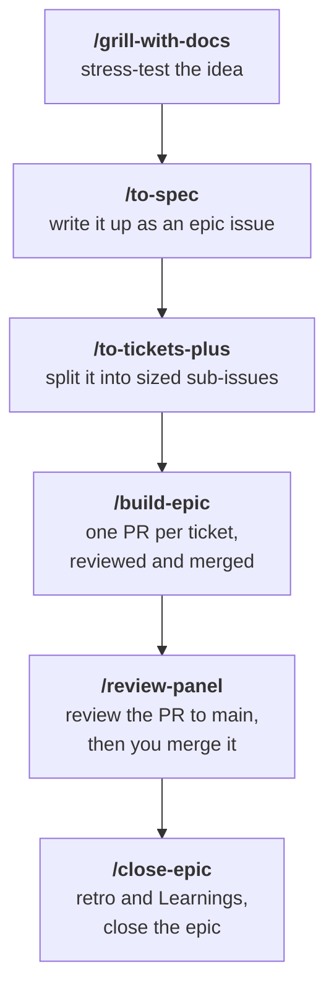

# syn54x/skills

Public [Agent Skills](https://agentskills.io) for coding agents (Cursor, Claude Code, Codex, and others).

## Install

### As skills (any agent)

```bash
npx skills add syn54x/skills --skill scaffold-python-project
npx skills add syn54x/skills --skill scaffold-frontend-project

# the SDD set
npx skills add syn54x/skills --skill setup-syn54x-skills --skill to-tickets-plus --skill build-epic \
  --skill implement-issue --skill review-pr --skill sync-progress --skill close-epic
npx skills add mattpocock/skills          # the spine: to-spec, to-tickets, tdd, …
```

Global install (available across projects):

```bash
npx skills add syn54x/skills --skill build-epic -g
```

Install for all detected agents:

```bash
npx skills add syn54x/skills --skill build-epic --agent '*'
```

### As a plugin (Claude Code, Cursor, Codex)

The `syn54x-skills` plugin bundles every skill in this repo with what `npx skills add` cannot install for the SDD set: two agents (`sdd-worker` on a mid-tier model in a worktree, `sdd-reviewer` read-only + `gh`), hooks (a stop-time verify gate, a worktree-remove guard) and helper scripts (`ready.sh`, `layers.py`, `progress-comment.sh`).

```
# Claude Code
/plugin marketplace add syn54x/skills
/plugin install syn54x-skills@syn54x

# Cursor (Agent chat)
/add-plugin syn54x-skills            # after the marketplace is registered or published at cursor.com/marketplace/publish

# Codex
codex plugin marketplace add syn54x/skills
codex                      # then /plugins → syn54x → syn54x-skills → Install; restart Codex
```

What each host gets:

| | npx skills | Claude Code plugin | Cursor plugin | Codex plugin |
|---|---|---|---|---|
| all skills in this repo | yes | yes | yes | yes |
| verify gate on stop | prose only | `Stop` / `SubagentStop` hook | `stop` / `subagentStop` hook | `Stop` / `SubagentStop` hook |
| worktree-remove guard | prose only | `WorktreeRemove` + `PreToolUse` hook | `beforeShellExecution` hook | `PreToolUse` hook |
| `sdd-worker`, `sdd-reviewer` agents | no | yes, with worktree isolation | yes (`readonly` reviewer; ask for worktree isolation) | no: Codex plugins have no agent slot yet |
| helper scripts | no | `${CLAUDE_PLUGIN_ROOT}/scripts` | `scripts/` in the plugin | `${PLUGIN_ROOT}/scripts` |
| XL dynamic workflow | no | yes | no | no |

The Cursor and Codex manifests are written against their published schemas and the same layout Compound Engineering and Pydantic ship, but the workflow has only been exercised end to end in Claude Code so far.

Then, for the SDD workflow, in each target repo:

1. Install mattpocock/skills yourself (`npx skills add mattpocock/skills`, or the `mattpocock-skills@mattpocock` plugin; not both) and run `/setup-matt-pocock-skills`, choosing **GitHub** as the tracker. That skill is user-invoked only, so no agent can run it for you.
2. Run `/setup-syn54x-skills`. It stops with the exact command if either half of step 1 is missing, then adds the labels, issue types and routing block. For the cloud path it copies `sdd-implement.yml` and `sdd-review.yml` into `.github/workflows/`; add an `ANTHROPIC_API_KEY` secret or switch the templates to OIDC.

Skills in this repo follow the [Agent Skills](https://agentskills.io) format (`SKILL.md` with YAML frontmatter). All skills live under `skills/`, which is the plugin's skill set for all three hosts. Plugin manifests live in `.claude-plugin/`, `.cursor-plugin/`, `.codex-plugin/` and `.agents/plugins/`; the extras are the root-level `agents/`, `hooks/` and `scripts/`, which `npx skills add` ignores.

Adding a skill: create `skills/<name>/SKILL.md` and add `./skills/<name>` to the `skills` array in `.claude-plugin/plugin.json`. The array is what makes `npx skills ls` group the pack under "Syn54x Skills" instead of "General". `scripts/check-plugin-skills.sh` fails when the array and the directory disagree; it runs in CI and as a [prek](https://prek.j178.dev) hook (`prek install` once).

## Skills

| Skill | Description |
|-------|-------------|
| [`adhd`](skills/adhd/) | Explains a topic in the shortest possible form — tiny sentences, lead with the point, then stop |
| [`eli5`](skills/eli5/) | Explains a complex topic in plain language with one concrete analogy |
| [`prepare-release-notes`](skills/prepare-release-notes/) | Drafts bloggy GitHub Release highlights from the delta since the last tag and prints the release command — never cuts the release |
| [`scaffold-python-project`](skills/scaffold-python-project/) | Opinionated Python project bootstrap with uv, prek, ruff, ty, pytest, zensical, GitHub Actions, and optional CLI/API/DB/AI stacks |
| [`scaffold-frontend-project`](skills/scaffold-frontend-project/) | Opinionated Vite + React SPA bootstrap with pnpm, Biome, TanStack Router/Query, Tailwind, shadcn/ui, prek, vitest, and GitHub Actions |

### Issue-native SDD

Spec-driven development where the **spec is an epic issue**, the **plan is its sub-issues** (native `--parent` / `--blocked-by`, `gh >= 2.94`), and **no plan files land in the repo**. The spine is [mattpocock/skills](https://github.com/mattpocock/skills) (`/grill-with-docs` → `/to-spec` → `/to-tickets` → `/triage`, `/tdd`); these skills sit on top of it for the build side.

#### How to use it



This is the M/L path, the common one; S and XL tickets run elsewhere (see the size ladder below).

**Setup, once per repo:**

1. Install mattpocock/skills: `npx skills add mattpocock/skills`.
2. Install these skills, as a plugin or with `npx skills add`: see [Install](#install).
3. Run `/setup-matt-pocock-skills` and pick **GitHub** as the tracker. You have to run this one yourself; agents can't invoke it.
4. Run `/setup-syn54x-skills`. It creates the labels and issue types and writes the routing block into CLAUDE.md or AGENTS.md.

#### Why this exists

Every spec-driven suite we surveyed (Superpowers, Compound Engineering, GSD, CCPM, PRPs, Spec Kit, BMAD, OpenSpec, cc-sdd, and a dozen smaller ones) keeps its plan in markdown files under `docs/plans/`, `.kiro/`, `openspec/` or similar. That has three costs:

- **Nobody reads the plan file.** Reviewers read issues and PRs. A plan that lives outside the tracker drifts from what shipped the moment the first PR merges, and the humans who need to approve the work never see it.
- **Two planners collide.** Install any two suites and they fight over who owns the plan, who owns the `CLAUDE.md` block, and which `/plan` command wins. Each one also preloads several thousand tokens into every session.
- **Orchestration is bespoke.** Each suite has its own executor loop reading its own file format, so the plan cannot be picked up by a different tool, a cloud runner, or a second person.

GitHub closed the gap in 2025–2026: sub-issues and issue types (Apr 2025), native blocked-by / blocking dependencies (Aug 2025), issue fields on org repos (Jul 2026), and `gh` 2.94 exposing all of it as flags (`--parent`, `--blocked-by`, `--type`) with JSON output. That makes the tracker itself a plan format any agent can read with one CLI and no extension.

So the design is a **cherry-pick, not a suite**:

- **mattpocock/skills is the spine** and stays untouched, so `npx skills update` keeps working. `/to-spec` already writes the epic; `/to-tickets` already cuts tracer-bullet sub-issues with blocking edges.
- **What was worth stealing became ticket sections**, not plugins: Compound Engineering's file ownership and verification contract, Superpowers' interfaces list, no-placeholder rule, fresh implementer and reviewer per task, CCPM's marker-based idempotent comments, gh-aw's sub-issue closer. All of it is `gh` and prose, so it runs the same under Claude Code, Codex, Cursor, or a shell.
- **Review effort follows the diff.** A slice PR into an integration branch gets one fresh reviewer with two verdicts; a persona panel on every slice would be nine times the cost for noise. The PR to `main` is large, final and cross-slice, so it gets `review-panel`: our own panel, built from the best of Compound Engineering's persona selection and adversarial reviewer, Anthropic's confidence gate and history pass, Superpowers' calibration, and mattpocock's standards axis, but reading our ticket contracts and ADRs and speaking our severity vocabulary.
- **Readiness is derived, never a status label**: open + no open blockers + unassigned + `ready-for-agent`. Claiming is assigning yourself. A status field that agents set is a status field that lies.
- **Worktree waves, not Agent Teams.** Teammates get no worktree isolation, the task tools are gated on an experimental flag, and a team costs several times the tokens of a wave. Every suite that tried teams either retreated to `Agent(isolation: "worktree")` or kept teams for discussion only.
- **Size decides the runtime.** Small tickets go to `claude-code-action` on a label; medium and large run as local waves; XL escalates to a dynamic workflow. Same `implement-issue` skill in every case.
- **The gates are hooks, not prose.** A worker on an `sdd/*` branch cannot stop without a recorded Verify run; a worktree with unpushed work cannot be removed.

Not adopted, and why: CCPM (unmaintained, wrong `gh-sub-issue` syntax), original GSD (archived, token rug-pull), Spec Kit's `taskstoissues` (one-way, no parent links), Agent OS (removed execution), oh-my-claudecode (teams-first, tmux), and the full Superpowers / Compound Engineering / ECC bundles as installed plugins alongside mattpocock (planner collisions, 3–22k tokens of preload). The ideas from the good ones are in the ticket sections above; the packages themselves are not dependencies.

| Skill | Description |
|-------|-------------|
| [`setup-syn54x-skills`](skills/setup-syn54x-skills/) | Once per repo, after `/setup-matt-pocock-skills`: check that mattpocock/skills is installed and configured for GitHub Issues, check `gh`, create the readiness and size labels, enable issue types on org repos, write the routing block into CLAUDE.md or AGENTS.md, optionally install the Actions workflows |
| [`to-tickets-plus`](skills/to-tickets-plus/) | Run `/to-tickets`, then link sub-issues natively (across repos when a ticket belongs elsewhere), add **Files owned / Interfaces / Test scenarios / Verify**, size them, and pin one plan comment on the epic |
| [`build-epic`](skills/build-epic/) | Orchestrator: ready queue → layers → parallel-safety check → isolated worker waves (3–5) → fresh review per PR → merge in dependency order → close. Multi-repo epics get one integration branch per repo |
| [`implement-issue`](skills/implement-issue/) | One worker, one issue, one PR with `Closes #N`; identical locally and inside `claude-code-action` |
| [`review-pr`](skills/review-pr/) | Slice gate. Fresh reviewer per PR: re-runs Verify, separate **spec** and **quality** verdicts, one fix round, then `ready-for-human` |
| [`review-panel`](skills/review-panel/) | Main gate. Once per epic, on the PR to `main`: `review-pr`'s spec and Coherence verdicts plus a persona panel (correctness, testing, maintainability, standards and invariants incl. ADRs, history; security, reliability, adversarial, data-migration, API-contract when warranted), one schema, one confidence gate, one report |
| [`sync-progress`](skills/sync-progress/) | Idempotent progress comments under `<!-- sdd-progress -->`; claim and unclaim by assignment |
| [`close-epic`](skills/close-epic/) | All sub-issues closed → summary comment with ticket → PR table and Learnings → close the epic |

**Size ladder** (`to-tickets-plus` labels each ticket; the label picks the runtime):

| Size | Ticket shape | Trigger | Runs where | Reviewer |
|---|---|---|---|---|
| **S** | one context window, ≤ 3 files | label `ready-for-agent` | cloud: `claude-code-action` (`sdd-implement.yml`) | `sdd-review.yml` on the PR |
| **M** | needs its plan sections; 1–2 workers | `/build-epic` or `/implement-issue` | local worker in its own worktree | fresh reviewer subagent |
| **L** / epic | 3+ sub-issues, cross-cutting | `/build-epic` | local waves, 3–5 workers, worktree each | reviewer per slice PR; `review-panel` on the PR to `main` |
| **XL** | 8+ independent sub-issues | `/build-epic --workflow` | dynamic workflow (Claude Code, `ultracode`) | scripted verify → merge order; `review-panel` on the PR to `main` |

Dispatch is harness-agnostic: `skills/build-epic/references/harness-dispatch.md` gives the concrete call for Claude Code (`Agent` + `isolation: "worktree"`, Agent Teams flag **unset**), Codex (subagent per worktree), Cursor (background agent per worktree), and a sequential fallback for anything else. Everything below the dispatch line is `gh` + prose and identical across tools.

Leave Superpowers, Compound Engineering and similar suites **uninstalled in target repos**; the routing block written by `setup-syn54x-skills` disables competing planners.

#### How the skills improve

Every epic leaves a trail in GitHub. `close-epic` turns it into a **retro** (tickets by size, escalations, edges added mid-build, fix rounds, Verify-block corrections, panel findings and dropped count, claim-to-PR time), posted on the epic and computed from labels, marker comments and PR reviews alone. Learnings are tagged **[repo]**, **[reusable]** or **[skill]**; a [skill] learning is one the retro numbers back up.

With the user's consent, [skill] learnings become `skill-feedback` issues on this repo. That channel is designed to carry nothing about the user's code:

- **Off by default**; `setup-syn54x-skills` asks, and the routing block records `Upstream feedback: on|off`.
- **Allowlist, not redaction**: skill, step, a category from a closed set, counts, harness version, and one sentence the user types. Never repo or org names, URLs, ticket titles, paths, code, commit messages or error text.
- **Previewed and approved per issue**, filed under the user's own account, publicly. `--dry-run` prints the bodies.
- **Never from a non-interactive run**; drafts go on the epic for the user to file or discard. Private repos always confirm.
- **A guard that blocks rather than rewrites**: URLs, repo names, existing paths, code, titles or error text in the body stop the filing.

The full rules and template: `skills/close-epic/references/skill-feedback.md`. Planned next: regression evals built from fixed defects, and a scheduled routine that clusters feedback into PRs on this repo.
