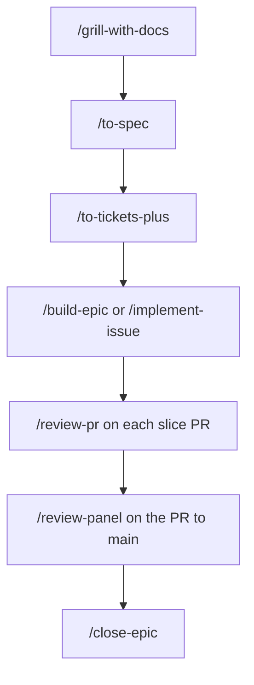

# syn54x/skills

Public [Agent Skills](https://agentskills.io) for Cursor, Claude Code, Codex, and other coding agents. The SDD skills sit on top of [mattpocock/skills](https://github.com/mattpocock/skills): the spec and the plan are GitHub issues, and this repo runs the build. Scaffolding, explanations, and release notes are separate skills.

## Install

```bash
npx skills add syn54x/skills                             # interactive install
npx skills add syn54x/skills --skill '*'                  # every skill
npx skills add syn54x/skills --skill build-epic          # one skill
npx skills add syn54x/skills --skill '*' -g              # global
npx skills add syn54x/skills --skill '*' --agent '*'     # every skill, every detected agent
```

`adhd`, `eli5`, `prepare-release-notes`, `scaffold-python-project`, and `scaffold-frontend-project` work as soon as they are installed. The SDD skills need mattpocock/skills and a per-repo setup, in the next section.

The `syn54x-skills` plugin installs the same skills, plus the agents, hooks, and scripts that `npx skills add` leaves out (`sdd-worker`, `sdd-reviewer`, the verify and worktree hooks, `ready.sh`, `layers.py`, `progress-comment.sh`).

```
# Claude Code
/plugin marketplace add syn54x/skills
/plugin install syn54x-skills@syn54x

# Cursor (Agent chat)
/add-plugin syn54x-skills            # after the marketplace is registered or published at cursor.com/marketplace/publish

# Codex
codex plugin marketplace add syn54x/skills
codex                      # then /plugins → syn54x → syn54x-skills → Install; restart Codex
```

Per-host differences are in [What the plugin adds](#what-the-plugin-adds).

## Set up

Once per repo, before `to-tickets-plus`, `build-epic`, or `implement-issue`. The five skills named above skip this.

### 1. Install and configure mattpocock/skills

Use one install. The `npx` skills and the plugin both load if you install both.

```bash
npx skills add mattpocock/skills
npx skills add mattpocock/skills -g           # global
npx skills add mattpocock/skills --agent '*'  # every detected agent
```

Claude Code, as a plugin:

```
/plugin marketplace add mattpocock/skills
/plugin install mattpocock-skills@mattpocock
```

New skills may need a session restart before you can run them.

Then run `/setup-matt-pocock-skills`. Choose GitHub as the issue tracker and keep the default triage labels. The skill is user-invoked only, and an agent cannot run it for you. It writes `docs/agents/issue-tracker.md`.

Install `gh` 2.94 or newer and authenticate it (`gh auth status`). The SDD skills use `--parent`, `--blocked-by`, and `--type`.

### 2. Run `/setup-syn54x-skills`

It stops with the exact command if step 1 is incomplete. When the checks pass, it:

- creates the readiness and size labels
- on an organization repo, asks before creating Epic and Task issue types (a personal repo has no issue types, so sizes stay labels)
- writes the routing block into `CLAUDE.md` or `AGENTS.md`, under the Agent skills section
- asks whether to copy `sdd-implement.yml` and `sdd-review.yml` into `.github/workflows/` for `size:S` tickets

For that cloud path, add an `ANTHROPIC_API_KEY` repository secret, or switch the workflow templates to OIDC. The templates default to the secret and leave the OIDC lines marked. If the target repo points at a fork of syn54x/skills, change `plugin_marketplaces` in both templates.

After that, the path is `/grill-with-docs`, then `/to-spec`, then `/to-tickets-plus`. Build with `/build-epic <epic#>` or by labelling a `size:S` ticket `ready-for-agent`.

## Use




`/grill-with-docs`, `/to-spec`, `/to-tickets`, `/tdd`, and `/triage` come from mattpocock/skills. This repo starts at `/to-tickets-plus`.

`size:S` can run in the cloud from the `ready-for-agent` label when the workflows from setup are installed. XL is `/build-epic <epic#> --workflow`. The size ladder below lists the other rows.

1. `/grill-with-docs` iron out the details of a new idea, feature, bug, etc.
2. `/to-spec` publish the details of the grilling session as a PRD (Epic) to the Issue Tracker you set up earlier.
3. `/to-tickets-plus` runs `/to-tickets`, links each sub-issue with `--parent` and `--blocked-by` (in another repo when the ticket belongs there), adds Files owned, Interfaces, Test scenarios, and Verify, sets a size, and pins one plan comment on the epic.
4. `/implement-issue <issue#>, <issue#>` for one or more individual tickets, or `/build-epic <epic#>` to coordinate the entire epic. The worker claims the issue, branches, writes a failing test first (`/tdd` when it is installed), runs the Verify block, and opens a PR with `Closes #N`. Workers do not merge.
5. `/review-pr` gates each slice PR into the integration branch: a fresh reviewer, Verify re-run, separate spec and quality verdicts, one fix round, then `ready-for-human`.
6. `/review-panel` gates the PR to `main`, once per epic.
7. `/close-epic` checks that every sub-issue is closed, posts the summary and the retro, and closes the epic.

A ticket is ready when it is open, has no open blockers, is unassigned, and carries `ready-for-agent`. Claiming is assigning yourself. Unclaim if you stop without a PR. Progress is one comment per issue, under `<!-- sdd-progress -->`, rewritten in place.

A multi-repo epic gets one integration branch, its own worktrees, and its own PRs in each repo. Tickets are identified by URL. A cross-repo blocker has to be merged and available (the API deployed, the client generated) before the consumer is ready.

The routing block tells the agent to leave brainstorming, writing-plans, ce-plan, and other plan-writing skills unused. `/to-spec` owns the spec. `/to-tickets-plus` owns the plan: the sub-issues and the plan comment. Never write that plan to `docs/plans`, `docs/specs`, or `.scratch/*/issues`. Leave Superpowers, Compound Engineering, and similar suites uninstalled in the target repo.

### Size ladder

`to-tickets-plus` sets the size. The size picks the runtime. `/implement-issue` is the worker in every row.


| Size | Ticket shape                                 | Trigger                             | Runs where                                        | Reviewer                                                              |
| ---- | -------------------------------------------- | ----------------------------------- | ------------------------------------------------- | --------------------------------------------------------------------- |
| S    | one context window, at most 3 files          | label `ready-for-agent`             | cloud: `claude-code-action` (`sdd-implement.yml`) | `sdd-review.yml` on the PR                                            |
| M    | needs its plan sections; 1 or 2 workers      | `/build-epic` or `/implement-issue` | local worker in its own worktree                  | fresh reviewer subagent                                               |
| L    | epic, or 3 or more sub-issues, cross-cutting | `/build-epic`                       | local waves, 3 to 5 workers, one worktree each    | reviewer per slice PR; `review-panel` on the PR to `main`             |
| XL   | 8 or more independent sub-issues             | `/build-epic --workflow`            | dynamic workflow (Claude Code, `ultracode`)       | scripted verify, then merge order; `review-panel` on the PR to `main` |


The concrete dispatch call for each tool is in `skills/build-epic/references/harness-dispatch.md`. Claude Code uses `Agent` with `isolation: "worktree"`, and the Agent Teams flag stays unset. Codex uses a subagent per worktree. Cursor uses a background agent per worktree. Any other harness runs the workers one at a time. Below the dispatch line in that file, the skills are `gh` and prose.

## Skills

### Standalone


| Skill                                                            | Description                                                                                                                                |
| ---------------------------------------------------------------- | ------------------------------------------------------------------------------------------------------------------------------------------ |
| `[adhd](skills/adhd/)`                                           | Explains a topic in the shortest form: tiny sentences, the point first, then stop                                                          |
| `[eli5](skills/eli5/)`                                           | Explains a complex topic in plain language, with one concrete analogy                                                                      |
| `[prepare-release-notes](skills/prepare-release-notes/)`         | Drafts bloggy GitHub Release highlights from the commits since the last tag and prints the release command. It does not cut the release    |
| `[scaffold-frontend-project](skills/scaffold-frontend-project/)` | Bootstraps a Vite and React SPA with pnpm, Biome, TanStack Router and Query, Tailwind, shadcn/ui, prek, vitest, and GitHub Actions         |
| `[scaffold-python-project](skills/scaffold-python-project/)`     | Bootstraps a Python project with uv, prek, ruff, ty, pytest, zensical, and GitHub Actions, plus optional CLI, API, database, and AI stacks |


### SDD

These need the setup above.


| Skill                                                | Description                                                                                                                                                                                                                   |
| ---------------------------------------------------- | ----------------------------------------------------------------------------------------------------------------------------------------------------------------------------------------------------------------------------- |
| `[setup-syn54x-skills](skills/setup-syn54x-skills/)` | Once per repo, after mattpocock/skills is configured for GitHub Issues. Checks `gh`, creates the readiness and size labels, enables issue types on org repos, writes the routing block, and can install the Actions workflows |
| `[to-tickets-plus](skills/to-tickets-plus/)`         | Runs `/to-tickets`, links sub-issues natively (across repos when a ticket belongs elsewhere), adds Files owned, Interfaces, Test scenarios, and Verify, sizes them, and pins one plan comment on the epic                     |
| `[build-epic](skills/build-epic/)`                   | Ready queue, then layers, a parallel-safety check, worker waves of 3 to 5, a fresh review per PR, and merge in dependency order. Multi-repo epics get one integration branch per repo. `--workflow` for XL                    |
| `[implement-issue](skills/implement-issue/)`         | One ready issue, one PR with `Closes #N`. The same skill locally and inside `claude-code-action`                                                                                                                              |
| `[review-pr](skills/review-pr/)`                     | Slice gate. Fresh reviewer, re-runs Verify, separate spec and quality verdicts, one fix round, then `ready-for-human`                                                                                                         |
| `[review-panel](skills/review-panel/)`               | Main gate, once per epic, on the PR to `main`. Spec and Coherence verdicts from `review-pr`, plus a persona panel, one findings schema, one report                                                                            |
| `[sync-progress](skills/sync-progress/)`             | Rewrites the single progress comment under `<!-- sdd-progress -->`. Claim and unclaim by assignment                                                                                                                           |
| `[close-epic](skills/close-epic/)`                   | When every sub-issue is closed: summary comment with the ticket-to-PR table and learnings, the retro, optional skill-feedback, then closes the epic                                                                           |


## Why this sits on top of mattpocock/skills

The suites we looked at keep the plan in markdown: Superpowers, Compound Engineering, GSD, CCPM, PRPs, Spec Kit, BMAD, OpenSpec, cc-sdd, and a dozen smaller ones. The files live under `docs/plans/`, `.kiro/`, `openspec/`, or a similar directory.

- Reviewers read issues and PRs. A plan outside the tracker drifts from what shipped as soon as the first PR merges, and the people who have to approve the work never see it.
- Two installed suites fight over the plan, the `CLAUDE.md` block, and which `/plan` command wins. Each one also preloads several thousand tokens into every session.
- Each suite ships a runner for its own file format, so a different tool, a cloud runner, or another person cannot pick the plan up.

From 2025 through 2026, GitHub shipped sub-issues and issue types (April 2025), native blocked-by and blocking links (August 2025), issue fields on organization repos (July 2026), and `gh` 2.94 flags for them (`--parent`, `--blocked-by`, `--type`) with JSON output. An agent can read that plan with `gh`, without a separate extension.

mattpocock/skills stays as installed, so `npx skills update` still applies. `/to-spec` writes the epic. `/to-tickets` cuts tracer-bullet sub-issues and their blocking edges.

What was worth stealing from the other suites is now a section on the ticket, written as `gh` and prose, so it runs the same under Claude Code, Codex, Cursor, or a shell:

- Compound Engineering: file ownership and a verification contract
- Superpowers: the interfaces list, a no-placeholder rule, a fresh implementer and a fresh reviewer per task
- CCPM: comments that update in place under a marker
- gh-aw: a closer that walks sub-issues

Review effort follows the diff. A slice PR into the integration branch gets one fresh reviewer and two verdicts, spec and quality. A persona panel on every slice would cost nine times as much and produce noise. The PR to `main` is large, final, and spans the slices, so it gets `review-panel`. That panel uses Compound Engineering's persona selection and adversarial reviewer, Anthropic's confidence gate and history pass, Superpowers' calibration, and mattpocock's standards axis. It reads the ticket contracts and the repo's ADRs, and it uses this repo's severity vocabulary.

Readiness is computed from the tracker: open, no open blockers, unassigned, and labelled `ready-for-agent`. You claim a ticket by assigning yourself. The skills do not store readiness in a status field, because an agent-written status goes stale.

Workers run in waves of 3 to 5, each in its own worktree. The Agent Teams flag stays unset. Teammates get no worktree of their own, the task tools sit behind an experimental flag, and a team costs several times the tokens of a wave. Suites that tried teams went back to `Agent(isolation: "worktree")`, or they kept teams for discussion only.

Where the plugin is installed, hooks enforce the stop rules. A worker on an `sdd/*` branch cannot stop without a recorded Verify run. A worktree with unpushed work cannot be removed. With only `npx skills add`, those rules are in the skill text.

None of these is a dependency:

- CCPM is unmaintained, and its docs use the wrong `gh-sub-issue` syntax.
- The original GSD is archived, after a token rug-pull.
- Spec Kit's `taskstoissues` exports one way and does not create parent links.
- Agent OS removed execution.
- oh-my-claudecode is built around Agent Teams and tmux.
- The full Superpowers, Compound Engineering, and ECC bundles, installed next to mattpocock, collide on the planner and preload 3k to 22k tokens.

### Retros and skill feedback

`close-epic` posts a retro on the epic under `<!-- sdd-retro -->`. The counts come from label events, marker comments, and PR reviews: tickets by size, escalations, edges added mid-build, fix rounds, Verify-block corrections, panel findings, how many findings were dropped, and claim-to-PR time. The retro names which workflow step was weak. It stays in the user's repo.

Learnings are tagged `[repo]`, `[reusable]`, or `[skill]`. A `[skill]` learning is one the retro counts support.

With consent, a `[skill]` learning can become a `skill-feedback` issue on this repo. Setup asks, and the default is off, recorded as `Upstream feedback: on` or `off` in the routing block.

An issue may contain the skill, the step, a category from a closed set, counts, the harness version, and one sentence the user types. It may not contain repo or org names, URLs, ticket titles, paths, code, commit messages, or error text.

- Each issue is shown and approved on its own, filed under the user's GitHub account, and the issue is public. `--dry-run` prints the bodies.
- A non-interactive run never files. Drafts go on the epic for the user to file or discard. A private repo always asks for confirmation.
- A URL, repo name, existing path, code, title, or error text in the body stops the filing. The guard does not rewrite the body.

Rules and template: `skills/close-epic/references/skill-feedback.md`.

Planned next: regression evals built from fixed defects, and a scheduled routine that clusters feedback into PRs on this repo.

## What the plugin adds


|                                     | npx skills | Claude Code plugin                   | Cursor plugin                                         | Codex plugin                             |
| ----------------------------------- | ---------- | ------------------------------------ | ----------------------------------------------------- | ---------------------------------------- |
| all skills in this repo             | yes        | yes                                  | yes                                                   | yes                                      |
| verify gate on stop                 | prose only | `Stop` / `SubagentStop` hook         | `stop` / `subagentStop` hook                          | `Stop` / `SubagentStop` hook             |
| worktree-remove guard               | prose only | `WorktreeRemove` + `PreToolUse` hook | `beforeShellExecution` hook                           | `PreToolUse` hook                        |
| `sdd-worker`, `sdd-reviewer` agents | no         | yes, with worktree isolation         | yes (`readonly` reviewer; ask for worktree isolation) | no: Codex plugins have no agent slot yet |
| helper scripts                      | no         | `${CLAUDE_PLUGIN_ROOT}/scripts`      | `scripts/` in the plugin                              | `${PLUGIN_ROOT}/scripts`                 |
| XL dynamic workflow                 | no         | yes                                  | no                                                    | no                                       |


The Cursor and Codex manifests follow their published schemas and the same layout Compound Engineering and Pydantic ship. The workflow has been run end to end in Claude Code so far.

## Add a skill

Create `skills/<name>/SKILL.md` and add `./skills/<name>` to the `skills` array in `.claude-plugin/plugin.json`. That array is what makes `npx skills ls` group the pack under "Syn54x Skills" instead of "General". `scripts/check-plugin-skills.sh` fails when the array and the directory disagree. It runs in CI and as a [prek](https://prek.j178.dev) hook (`prek install` once).

Skills follow the Agent Skills format (`SKILL.md` with YAML frontmatter). They live under `skills/`. Plugin manifests live in `.claude-plugin/`, `.cursor-plugin/`, `.codex-plugin/`, and `.agents/plugins/`. `agents/`, `hooks/`, and `scripts/` are at the repo root, and `npx skills add` ignores them.
